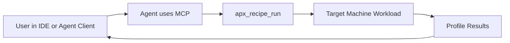
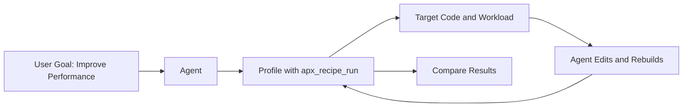

# Using `apx_recipe_run` in MCP

This guide is for users who want to run Arm Performix profiling through the MCP tool `apx_recipe_run`.

## MCP Context (User View)

MCP (Model Context Protocol) is the interface your agent/client uses to call tools exposed by an MCP server.

In this workflow:

- You ask your agent to profile a workload.
- The agent calls the MCP tool `apx_recipe_run`.
- The tool profiles your target workload and returns results.

You generally do not need to manage APX internals directly.

## Shared Setup (Required for Both Scenarios)

Complete this setup before using either scenario.

### 1. SSH keys are required

You must have SSH access to the target machine.

Set private key permissions:

```bash
chmod 600 /path/to/key
```

Validate SSH access:

```bash
ssh -i /path/to/key <remote_user>@<target_ip>
```

### 2. MCP server runtime must have the SSH files mounted

Your MCP server/container configuration must mount:

- the private key file under `/run/keys`
- the `known_hosts` file under `/run/keys`

The MCP container will discover these mounts from `/proc/self/mounts` and set the internal `SSH_KEY_PATH` and `KNOWN_HOSTS_PATH` values automatically.

### 3. Target workload must be runnable

- The target machine must be reachable.
- Your workload command must run on the target machine.
- Use absolute paths where possible.

### 4. Know what input values you will provide

`apx_recipe_run` needs:

- `cmd`
- `remote_ip_addr`
- `remote_usr`
- `recipe`

## Recipe Explanations

Choose the recipe based on what question you are trying to answer.

- `code_hotspots`: Shows where execution time is spent (functions/paths). Best default for most profiling starts.
- `instruction_mix`: Shows instruction type distribution (compute, memory, branch, etc.) to understand how code uses hardware.
- `cpu_microarchitecture`: Shows where cycles are lost (frontend, backend, speculation, retiring) for deeper CPU bottleneck diagnosis.
- `memory_access`: Focuses on memory behavior and bottlenecks (cache usage, latency, locality).
- `all`: Runs all recipe perspectives when available.

Important note:

- `code_hotspots` is usually the safest default.
- Other recipes may require broader PMU counter access on the target.

## Scenario 1: Profiling Only (No Agent Code Changes)

Use this when you only want to profile an existing workload and get performance data.

### What you set up

- MCP + agent/client on your local machine.
- Target machine with workload already installed.
- SSH connectivity from MCP environment to target.

### Typical user flow

1. Ask your agent to run profiling with `apx_recipe_run`.
2. Provide `cmd`, `remote_ip_addr`, `remote_usr`, and `recipe` when prompted.
3. Review returned profile results.

### Diagram



## Scenario 2: Agent Profiles and Also Makes Code Changes

Use this when you want the agent to run an optimization loop on the target machine.

### What you set up

- Everything in Scenario 1.
- Full dev environment on the target machine where agent edits will happen.
- Source code access, build/test/runtime tools, and agent permissions for edit/run loops.
- SSH keys available there as needed (`chmod 600` still applies).

### Typical user flow

1. Agent profiles current workload via `apx_recipe_run`.
2. Agent makes code changes.
3. Agent rebuilds/reruns workload.
4. Agent re-runs `apx_recipe_run` to validate impact.

### Diagram



## Quick Decision Guide

- Choose Scenario 1 if you only need profiling output.
- Choose Scenario 2 if you want the agent to edit code and re-profile in the same environment.

## Common Troubleshooting

If `apx_recipe_run` fails:

- Verify SSH key permissions (`chmod 600 /path/to/key`).
- Verify the SSH key and `known_hosts` files are mounted into `/run/keys`.
- Verify target IP, username, and command path.
- Verify selected recipe is supported in your target environment.
